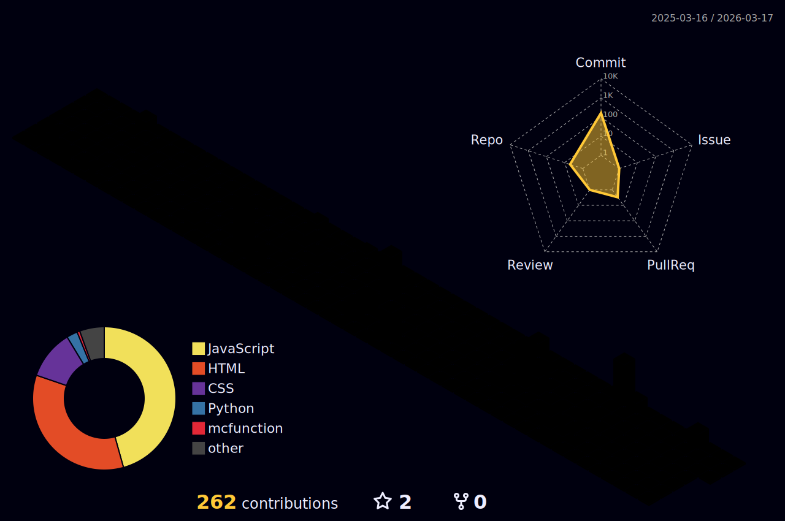

<!-- ═══════════════════════════════════════════════════════════════════════════
     🌌  KillaMeep's GitHub Profile  —  Cosmic Cyberpunk Edition
     ═══════════════════════════════════════════════════════════════════════════ -->

<!-- ╔══════════════════════════════════════════════════════════════╗
     ║                    ANIMATED HEADER                         ║
     ╚══════════════════════════════════════════════════════════════╝ -->

<div align="center">
  
</div>

<!-- ╔══════════════════════════════════════════════════════════════╗
     ║                   PROFILE VIEWS + TYPING SVG               ║
     ╚══════════════════════════════════════════════════════════════╝ -->

<div align="center">

  

  <br/>

  <a href="https://git.io/typing-svg">
    
  </a>

</div>

<br/>

<!-- ╔══════════════════════════════════════════════════════════════╗
     ║                       ABOUT ME                             ║
     ╚══════════════════════════════════════════════════════════════╝ -->

<div align="center">

```
⠀⠀⠀⠀⠀⠀⠀⣀⣤⣤⣤⣤⣤⣀⠀⠀⠀⠀⠀⠀⠀
⠀⠀⠀⠀⣠⣶⣿⣿⣿⣿⣿⣿⣿⣿⣶⣄⠀⠀⠀⠀   > whoami
⠀⠀⠀⣴⣿⣿⣿⣿⣿⣿⣿⣿⣿⣿⣿⣿⣦⠀⠀⠀   KillaMeep
⠀⠀⣼⣿⣿⣿⣿⣿⣿⣿⣿⣿⣿⣿⣿⣿⣿⣧⠀⠀
⠀⢸⣿⣿⣿⣿⣿⣿⣿⣿⣿⣿⣿⣿⣿⣿⣿⣿⡇⠀   > cat interests.txt
⠀⢸⣿⣿⣿⣿⣿⣿⣿⣿⣿⣿⣿⣿⣿⣿⣿⣿⡇⠀   Desktop Apps • Machine Learning
⠀⠀⢻⣿⣿⣿⣿⣿⣿⣿⣿⣿⣿⣿⣿⣿⣿⣿⡟⠀   Creative Coding • ASCII Art
⠀⠀⠀⠻⣿⣿⣿⣿⣿⣿⣿⣿⣿⣿⣿⣿⣿⠟⠀⠀   Open Source • Game Hacking
⠀⠀⠀⠀⠙⠿⣿⣿⣿⣿⣿⣿⣿⣿⣿⠿⠋⠀⠀⠀
⠀⠀⠀⠀⠀⠀⠈⠛⠿⠿⠿⠿⠛⠁⠀⠀⠀⠀⠀⠀   > echo $STATUS
⠀⠀⠀⠀⠀⠀⠀⠀⠀⠀⠀⠀⠀⠀⠀⠀⠀⠀⠀⠀   💜 Playing With Buttons
```

</div>

<div align="center">
  <a href="https://www.killameep.com">
    
  </a>
  
  <a href="https://github.com/KillaMeep">
    
  </a>
  
  <a href="https://discord.com/users/killameep">
    
  </a>
</div>

<br/>

<!-- ═══════════════════  DIVIDER  ═══════════════════ -->


<!-- ╔══════════════════════════════════════════════════════════════╗
     ║                      TECH STACK                            ║
     ╚══════════════════════════════════════════════════════════════╝ -->

<h2 align="center">🛠️ Tech Stack</h2>

<div align="center">
  <table>
    <tr>
      <td align="center"><b>Languages</b></td>
      <td align="center">
        <a href="https://skillicons.dev">
          
        </a>
      </td>
    </tr>
    <tr>
      <td align="center"><b>Frameworks &<br/>Libraries</b></td>
      <td align="center">
        <a href="https://skillicons.dev">
          
        </a>
      </td>
    </tr>
    <tr>
      <td align="center"><b>Tools &<br/>Platforms</b></td>
      <td align="center">
        <a href="https://skillicons.dev">
          
        </a>
      </td>
    </tr>
  </table>
</div>

<br/>

<!-- ═══════════════════  DIVIDER  ═══════════════════ -->


<!-- ╔══════════════════════════════════════════════════════════════╗
     ║                  GITHUB STATS ROW                          ║
     ╚══════════════════════════════════════════════════════════════╝ -->

<h2 align="center">📊 GitHub Analytics</h2>

<div align="center">
  <table>
    <tr>
      <td width="50%">
        
      </td>
      <td width="50%">
        
      </td>
    </tr>
  </table>
</div>

<div align="center">
  
</div>

<br/>

<!-- ═══════════════════  TROPHIES  ═══════════════════ -->

<div align="center">
  
</div>

<br/>

<!-- ═══════════════════  ACTIVITY GRAPH  ═══════════════════ -->

<div align="center">
  
</div>

<br/>

<!-- ═══════════════════  DIVIDER  ═══════════════════ -->


<!-- ╔══════════════════════════════════════════════════════════════╗
     ║                   FEATURED PROJECTS                        ║
     ╚══════════════════════════════════════════════════════════════╝ -->

<h2 align="center">🚀 Featured Projects</h2>

<div align="center">
  <table>
    <tr>
      <td width="50%">
        <h3 align="center">✨ Glyphify</h3>
        <div align="center">
          <a href="https://github.com/KillaMeep/Glyphify">
            
          </a>
          <br/><br/>
          
          
          
          <br/>
          <sub>Cross-platform desktop app converting images & videos into ASCII art<br/>with color output, 7 character sets, and CI/CD pipelines</sub>
        </div>
      </td>
      <td width="50%">
        <h3 align="center">🤖 beatblock-AI</h3>
        <div align="center">
          <a href="https://github.com/KillaMeep/beatblock-AI">
            
          </a>
          <br/><br/>
          
          
          
          <br/>
          <sub>Custom YOLOv5 model detecting 6 in-game elements in real time<br/>with GPU-accelerated inference across 52+ training runs</sub>
        </div>
      </td>
    </tr>
    <tr>
      <td width="50%">
        <h3 align="center">🐱 catgpt</h3>
        <div align="center">
          <a href="https://github.com/KillaMeep/catgpt">
            
          </a>
          <br/><br/>
          
          
          
          <br/>
          <sub>Full-stack ChatGPT parody with NLP sentiment analysis,<br/>real-time streaming, and Playwright E2E test coverage</sub>
        </div>
      </td>
      <td width="50%">
        <h3 align="center">🎨 ASCII-gen</h3>
        <div align="center">
          <a href="https://github.com/KillaMeep/ASCII-gen">
            
          </a>
          <br/><br/>
          
          
          
          <br/>
          <sub>Python CLI & GUI tool for GIF/MP4 to ASCII conversion<br/>— the project that directly inspired Glyphify</sub>
        </div>
      </td>
    </tr>
  </table>
</div>

<br/>

<!-- ═══════════════════  DIVIDER  ═══════════════════ -->


<!-- ╔══════════════════════════════════════════════════════════════╗
     ║                    MORE STATS (COLLAPSIBLE)                ║
     ╚══════════════════════════════════════════════════════════════╝ -->

<h2 align="center">📈 Deep Dive</h2>

<details>
<summary align="center"><b>🕐 Productivity & Language Breakdown</b></summary>
<br/>
<div align="center">
  <table>
    <tr>
      <td>
        
      </td>
      <td>
        
      </td>
      <td>
        
      </td>
    </tr>
  </table>
</div>
</details>

<details>
<summary align="center"><b>🧊 3D Contribution Calendar</b></summary>
<br/>
<div align="center">
  
  <br/>
  <sub><i>Generated daily via GitHub Actions — if this doesn't load, trigger the workflow manually.</i></sub>
</div>
</details>

<details>
<summary align="center"><b>📋 Full Profile Summary</b></summary>
<br/>
<div align="center">
  
</div>
<br/>
<div align="center">
  <table>
    <tr>
      <td>
        
      </td>
    </tr>
  </table>
</div>
</details>

<br/>

<!-- ═══════════════════  DIVIDER  ═══════════════════ -->


<!-- ╔══════════════════════════════════════════════════════════════╗
     ║                     DEV QUOTE                              ║
     ╚══════════════════════════════════════════════════════════════╝ -->

<div align="center">
  <br/>
  <a href="https://github.com/piyushsuthar/github-readme-quotes">
    
  </a>
  <br/><br/>
</div>

<!-- ╔══════════════════════════════════════════════════════════════╗
     ║                    ANIMATED FOOTER                         ║
     ╚══════════════════════════════════════════════════════════════╝ -->

<div align="center">
  
</div>
